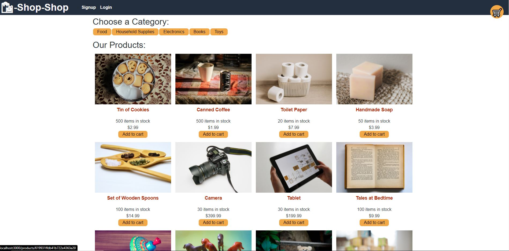

# Redux Store

# Table of Contents

[Description](#description) -
[Install](#install) -
[Usage](#usage) - 
[Links](#links) - 
[Contact](#contact) -
[Technologies](#technologies)

## Description

This app was designed using Context API and the goal was to modify the code to use Redux instead. This was done by creating a new store.js that would created a redux store using the already created reducers file. Doing this allows for the initial state to be changed from being passed in the GlobalState to being passed in with the reducers, this also changes how the reducers needed to be exported as well. The next change was to the Provider in app.js to use the react-redux Provider and passing in the new store from store.js. The final step was changing the state and dispatch in different component files to useDispatch or useSelector from react-redux instead. This allows the app to use Redux instead of Context API

## Install

Please use **'npm i'** in the command line to install the dependencies.

## Usage

When ready use **'npm run develop'** into the command line to run.

## Links

  
[Walkthrough Video](https://youtu.be/UTDLVyr3BlA)  
[Deployed App](https://cryptic-falls-36875.herokuapp.com/)  
[GitHub](https://github.com/niklasertle/nje-redux-store)

## Contact

[GitHub Profile](https://github.com/niklasertle) 
[Email Me](mailto:nik.ertle16@gmail.com)

## Technologies

